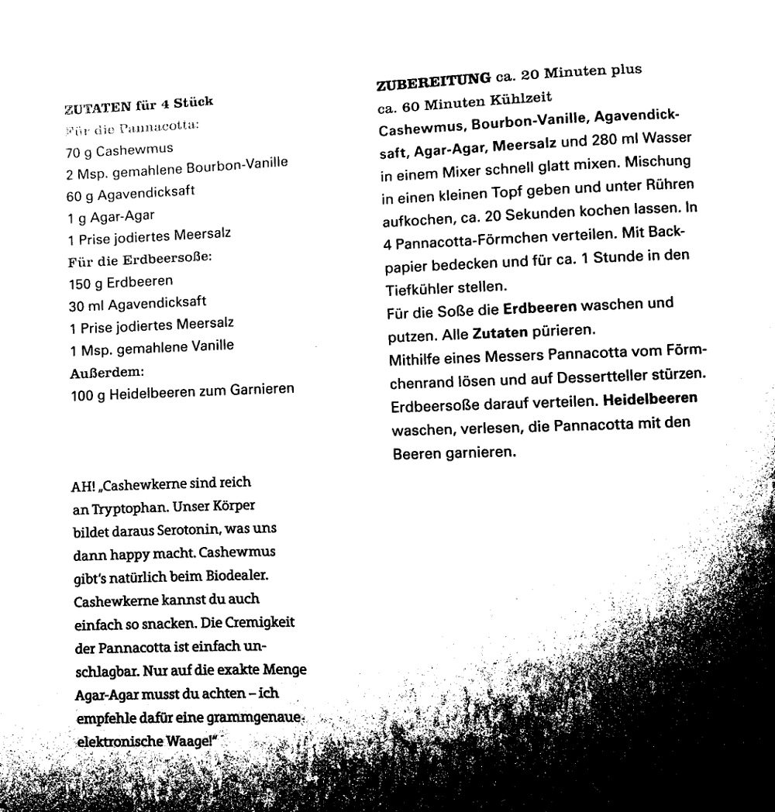

cashew pannacotta with strawberry sauce

4 persons

pannacotta:

- 280 g wasser
- 70 g cashewmus
- 2 msp bourbonvanille
- 60 g agavendicksaft
- 1 g agar-agar
- 1 prise salz

erdbeersosse:

- 150 g erdbeeren
- 30 g agavendicksaft
- 2 msp bourbonvanille
- 1 prise salz
- pfeffer

garnieren:

- 100 g heidelbeeren

zubereitung 20 minuten + 60 minuten kuehlzeit

pannacottazutaten glatt mixen.
20 sekunden aufkochen.
in 4 foermchen verteilen.
1 stunde in den tiefkuehler

erdbeeren putzen.
mit uebrigen zutaten puerieren.

sosse auf die panacotaa verteilen.
mit heidelbeeren garnieren.

