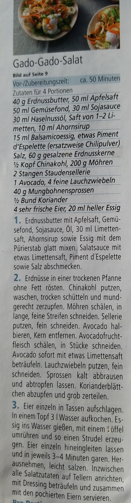

# Gado-Gado

Please refer to [wikipedia for a generic gado-gado recipe](https://en.wikipedia.org/wiki/Gado-gado).

Here is Lina's special one:

2019-12-16

fuer fuenf:

- zwiebel anbraten
- kartoffel 6 mm wuerfel anbraten
- lauch anbraten
- moehren anbraten
- chilischote
- ingwer
- knoblauch
- erdnuesse
- wirz
- mais
- kidneybohnen
- sojasosse
- balsamicoessig
- saft einer limone
- koriander leaves

suggestions for next time:

- sweeter, e.g., with raisin, apple, m ango, dates, ananas
- stronger, more taste, e.g., chili, chili paste, soy sauce, etc.
